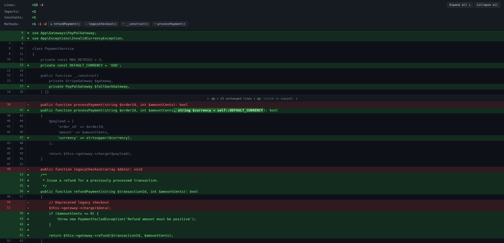
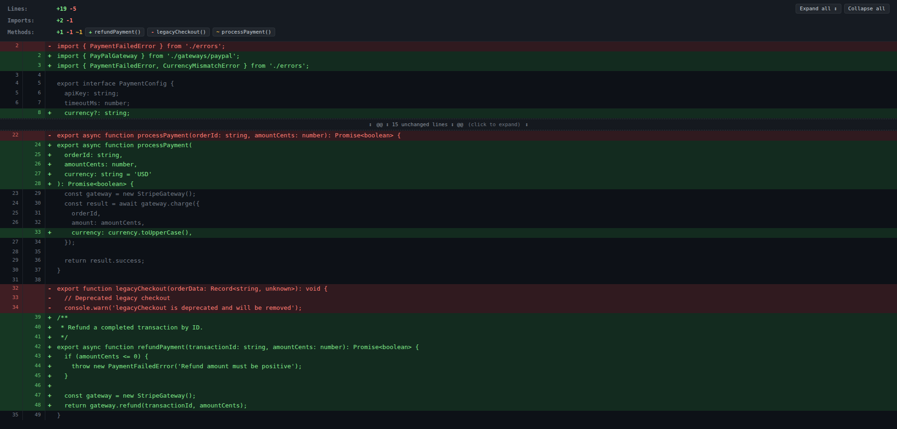

# Structural Git Diff for VS Code

[](LICENSE)
[](https://code.visualstudio.com/)

**Structural Git Diff** is an AST-aware semantic Git diff viewer and repository navigator for Visual Studio Code.

Instead of presenting raw, noisy diffs cluttered with formatting shifts, it understands code structure to highlight exactly what changed in your classes, methods, functions, properties, constants, and imports.

For non-code files (Markdown, JSON, YAML, CSS, HTML, SQL, etc.), it provides the same fast, unified, keyboard-friendly diff viewer with intelligent hunk folding and intra-line word highlights.

---



*Semantic structural diff for PHP: method & symbol breakdown (+ / - / ~), intelligent unchanged folding, and intra-line word highlights.*



*AST-aware diff for TypeScript & JavaScript: function, interface, type, and import tracking.*

---

## Features

### 1. AST-Aware Semantic Diffing (PHP, TypeScript, JavaScript)
- **Structure Breakdown:** Instant summary showing added, modified, and deleted methods, functions, constants, properties, and imports (`use` / `import` statements).
- **Intelligent Folding:** Automatically collapses unchanged methods and large blocks, letting you focus on actual changes. Click any hunk banner to expand.
- **Intra-Line Word Highlights:** Highlights precise inline word edits with clean diff semantics without false-positive character splits.
- **Interactive Quick Navigation:** Click any method or symbol badge in the summary header to immediately jump to its location with animated focus highlighting.

### 2. Universal Git Diff for All Files
- **Code Files:** Full AST analysis for **PHP** (including modern PHP 8.0–8.4 syntax), **TypeScript**, **JavaScript**, **TSX**, **JSX**.
- **All Text Files:** Markdown, JSON, YAML, CSS, SCSS, HTML, SQL, Shell scripts, Dockerfiles, etc., open directly in the unified diff viewer with line statistics (`Lines: +X -Y`), hunk folding, and word highlights.
- **Binary Detection:** Automatically identifies binary files (images, fonts, archives) with a clean notification and zero UI glitches.

### 3. Integrated Git Navigator Sidebar
- **Working Changes:** View all uncommitted files. Commit directly from the tree with the `Commit all changes...` action or inline commit button.
- **Local & Remote Branches:**
  - Local branches sorted by commit date with upstream tracking indicators (`↑ahead`, `↓behind`, `gone`, `local`).
  - 1-click branch switching via checkout buttons or the branch switcher palette.
  - Remote-only branches listed cleanly without duplicating existing local branches.
- **Commit History Explorer:** Expand any branch to inspect recent commits and view the specific files changed in each commit.
- **Load More Commits:** Dynamically page through Git history in chunks of 30 commits.

### 4. Seamless Keyboard & Mouse Workflow
- **Arrow-Key Navigation (↑ / ↓):** Moving through files in the sidebar updates the diff preview live via seamless in-place DOM messaging without stealing keyboard focus or rebuilding the webview.
- **Double-Click to Edit:** Single-click previews the diff; double-click opens the file directly in the standard editor tab for editing.
- **Inline Action Buttons:** Inline pencil icon `$(edit)` to open files immediately in the editor.
- **Live Sync on Save:** Editing and saving a file automatically updates the structural diff preview in real time.

---

## Usage

### Opening Diffs
- **From Sidebar:** Open the **Structural Git Diff** container in the Activity Bar and click any modified file.
- **From Git Source Control View:** Click the inline compare icon `$(git-compare)` next to any file in VS Code's SCM panel.
- **From Editor:** Click the compare button in the editor title bar or right-click within the editor and select **Open Structural Diff**.
- **From Command Palette:** Press `Ctrl+Shift+P` (or `Cmd+Shift+P` on macOS) and run `Open Structural Diff`.

### Commands

| Command | Title | Description |
| :--- | :--- | :--- |
| `structuralDiff.openDiff` | Open Structural Diff | Open diff for working tree vs HEAD |
| `structuralDiff.openCommitDiff` | Open Commit Diff | Open diff for a specific Git commit |
| `structuralDiff.switchBranch` | Switch Git Branch | Checkout a local Git branch via QuickPick |
| `structuralDiff.refreshExplorer` | Refresh Git Explorer | Reload Git status, branches, and commits |
| `structuralDiff.commitChanges` | Commit Working Changes | Prompt for message and commit all uncommitted changes |
| `structuralDiff.editFile` | Edit File | Open file in text editor for modifications |

---

## Development & Contributing

### Requirements
- Node.js >= 20.0
- npm / pnpm

### Setup
```bash
git clone https://github.com/branzoni/vscode-structural-git-diff.git
cd vscode-structural-git-diff
npm install
```

### Build & Test
```bash
# Run type checking
npm run typecheck

# Build and run unit tests
npm test

# Build in watch mode
npm run watch

# Package as VSIX
npm run package
```

---

## License

This project is licensed under the [MIT License](LICENSE).
